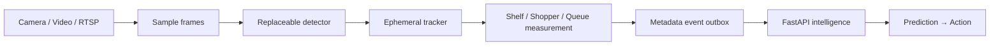

# Niriksh Edge Vision

An independently runnable, privacy-first computer-vision pipeline that converts local video into structured retail observations. Business predictions and recommendations remain in the FastAPI intelligence service.



## Setup

```bash
cd edge
python -m pip install -r requirements.txt
python -m niriksh_edge.main --config configs/shelf_demo.yaml --model models/yolo11n.pt
```

Without `--model`, the null detector exercises capture, health, event transport, and privacy behavior. No weights are downloaded automatically. Review [THIRD_PARTY_NOTICES.md](THIRD_PARTY_NOTICES.md) before enabling Ultralytics.

Input modes:

```bash
# Repeatable video
python -m niriksh_edge.main --config configs/shopper_demo.yaml --source samples/entrance/store.mp4 --model models/yolo11n.pt

# USB camera
python -m niriksh_edge.main --config configs/shopper_demo.yaml --source 0 --model models/yolo11n.pt --visualize

# RTSP (supply credentials through environment/config expansion, never commit them)
python -m niriksh_edge.main --config configs/queue_demo.yaml --source "$NIRIKSH_RTSP_URL" --model models/yolo11n.pt
```

The optional `--visualize` window is local-only. `debug.save_frames` defaults to `false`; the runtime never creates frame directories or uploads image data. Track IDs exist only in process memory and expire after timeout. Only counts, dwell aggregates, grid intensity, shelf occupancy, queue metrics, and camera status leave the device.

## Modules

- `capture`: file, webcam, or RTSP ingestion with fixed sampling.
- `detectors`: generic detector contract and optional YOLO adapter.
- `trackers`: ephemeral ByteTrack-compatible adapter boundary.
- `shelf`: generic occupied-area estimation plus SKU-aware extension point.
- `shopper`: line crossing, zone dwell, and modest rolling heatmap grids.
- `queue`: membership, waiting-time percentiles, and service-rate hooks.
- `events`: non-blocking async delivery and SQLite metadata-only retry outbox.
- `runtime`: replaceable PyTorch, ONNX, and explicit unavailable-QNN adapters.

Run `pytest -q`. Tests use synthetic coordinates/frames and require no camera. Dataset utilities in `tools/` extract frames, split data, validate YOLO labels, and calculate evaluation metrics. Training is never started automatically.

Performance is logged from actual runtime measurements (inference latency and local pipeline FPS); no benchmark is claimed. For ONNX and Qualcomm preparation, see `docs/onnx-export.md` and `docs/qualcomm-deployment.md`.
